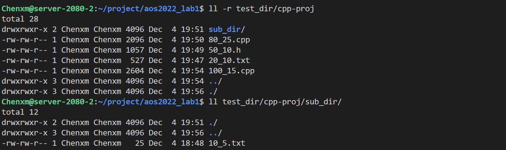
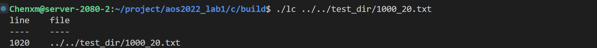
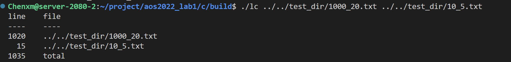
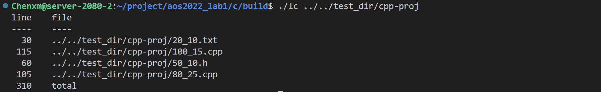
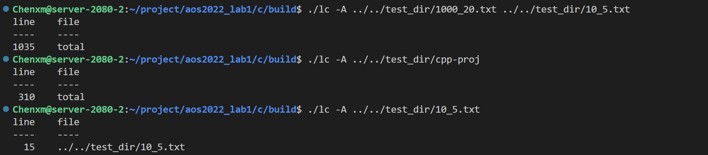
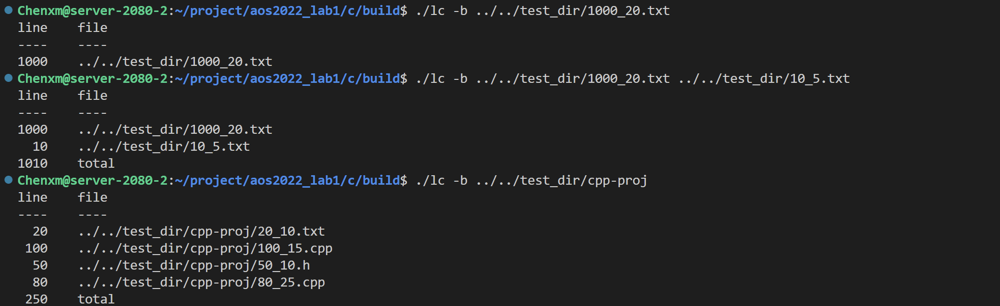
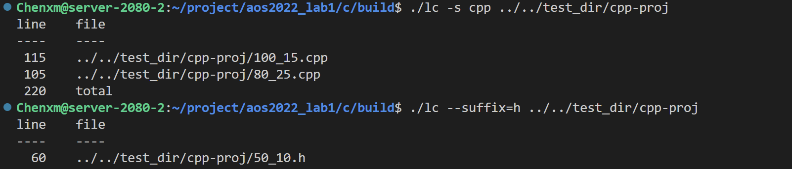
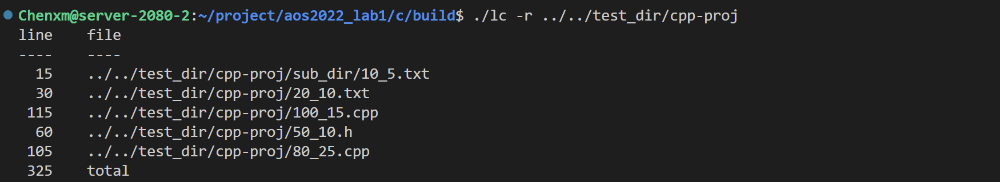
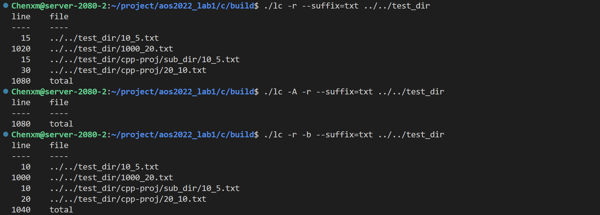

# lab1 文件IO 项目介绍与测试

## 1. 实验任务

实现一个代码行统计工具 **lc** （line counter），该工具统计给定目录或文件的代码行数。**lc**命令参数如下：

```bash
$ lc --help
Usage: lc [OPTION] ... [FILE | DIR] ...
Print newline counts for each FILE or DIR, and a total line if more than one FILE is specified.

With no FILE, or when FILE is -, read standard input.

The options below may be used to control print msg
    -A, --all                     print the total line number only
    -b                            ignore the Blank line when counting
    -r                            count directory Recursively
    -s, --suffix=FILE-SUFFIX    only count the file with specified Suffix
    -h, --help                    display this Help and exit
```

## 2. C语言实现方案

### 项目架构

```bash
├────c
│    ├────CMakeLists.txt
│    ├────include
│    │    └────lc.h
│    ├────main
│    │    └────lc.c
│    └────src
│    │    └────lcTools.c
```

### 函数实现功能说明

（1）include/lc.h

- to define the header files
- to define extern variable
- to define related functions

（2）src/lcTools.c

- to define 3 functions for counting lines
  - function "analysis" is used to analyse files.
  - function "dirAnalysis" is used to directory analysis.
  - function "countLines" is used to count lines.

（3）main/lc.c

- to define global variable
- to define "main" function to parse command

（*）扩展任务1：提供异常处理

本项目使用函数判断以及自定义报错字符串进行异常处理，其中使用C语言错误代码errno辅助错误类型判断。

异常处理示例，包括但不限于：

- 文件权限不可读

```python
if ((fp = fopen(fileName, "r")) == NULL)
{
    printf("[ERROR %d] Failed to open file: %s\n", errno, fileName);
    exit(1);
}
```

- 输入命令的文件参数缺失

```python
else  
{
    printf("[ERROR %d] No directory file or regular file entered.\n", errno);
    exit(1);
}
```

## 3. 项目测试

程序执行目录假定如下，文件名称为方便实验结果验证，定义为（非空行数_空行数）。

```bash
$ tree . -L 10
.
├── 1000_20.txt            # 表示有1000行非空行，20行空行，总共1020行
├── 10_5.txt
└── cpp-proj
    ├── 100_15.cpp
    ├── 20_10.txt
    ├── 50_10.h
    └── 80_25.cpp
    └── sub_dir
        └── 10_5.txt
```



### 测试1   单文件

```bash
$ lc 1000_20.txt
line     file
----    ----
1020     1000_20.txt        # 行数右对齐 文件名左对齐
```


### 测试2 多文件

```bash
$ lc 1000_20.txt 10_5.txt
line    file
----    ----
1020     1000_20.txt
  15     10_5.txt
1035     total            # 当不只一个文件时输出总行数
```


### 测试3 文件夹

```bash
$ lc cpp-proj            # 输出文件夹中所有文件行数
line    file
----    ----
 115     cpp-proj/100_15.cpp
 105     cpp-proj/80_25.cpp
  60     cpp-proj/50_10.h
  30     cpp-proj/20_10.txt
 310     total
```


### 测试4  --all选项

```bash
$ lc -A 1000_20.txt 10_5.txt
line    file
----    ----
1035    total

$ lc cpp-proj
line    file
----    ----
 310     total

$ lc --all 10_5.txt  # 如果只有一个文件则选项不起作用
line    file
----    ----
  15    10_5.txt
```


### 测试5  -b选项 忽略空行

```bash
$ lc -b 1000_20.txt
line     file
----    ----
1000     1000_20.txt

$ lc -b 1000_20.txt 10_5.txt
line    file
----    ----
1000     1000_20.txt
  10     10_5.txt
1010     total

$ lc -b cpp-proj
line    file
----    ----
 100     cpp-proj/100_15.cpp
  80     cpp-proj/80_25.cpp
  50     cpp-proj/50_10.h
  20     cpp-proj/20_10.txt
 250     total
```


### 测试6 --suffix选项

```bash
$ lc -s cpp cpp-proj
line    file
----    ----
 115     cpp-proj/100_15.cpp
 105     cpp-proj/80_25.cpp
 220     total

$ lc --suffix=h cpp-proj
line    file
----    ----
  60     cpp-proj/50_10.h
```


### 测试7 -r选项

```bash
$ lc -r cpp-proj                # 递归遍历子文件夹文件
line    file
----    ----
 115    cpp-proj/100_15.cpp
 105     cpp-proj/80_25.cpp
  60    cpp-proj/50_10.h
  30     cpp-proj/20_10.txt
  15     cpp-proj/sub_dir/10_5.txt
 325    total
```


### 测试8 混合选项

```bash
$ lc -r --suffix=txt .            # 递归统计当前文件夹下后缀为txt的文件的行数
line    file
----    ----
  15     ./10_5.txt
1020     ./1000_20.txt
  30     ./cpp-proj/20_10.txt
  15     ./cpp-proj/sub_dir/10_5.txt
1080     total

$ lc -A -r --suffix=txt .        # 递归统计当前文件夹下后缀为txt的文件的总行数
line    file
----    ----
1080     total

$ lc -r -b --suffix=txt .        # 递归统计当前文件夹下后缀为txt的文件的非空行数
  10     ./10_5.txt
1000     ./1000_20.txt
  20     ./cpp-proj/20_10.txt
  10     ./cpp-proj/sub_dir/10_5.txt
1040     total
```


### 测试9 异常测试


